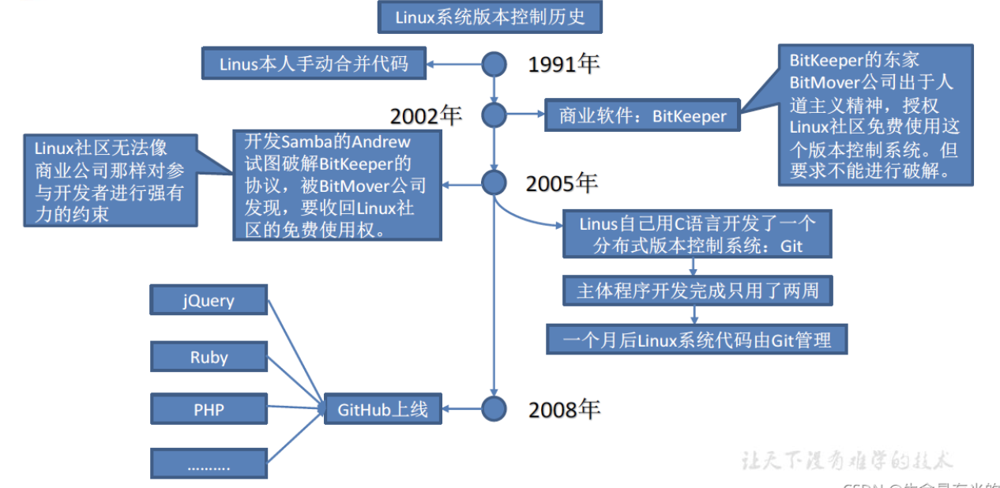

---
# try also 'default' to start simple
theme: seriph
# random image from a curated Unsplash collection by Anthony
# like them? see https://unsplash.com/collections/94734566/slidev
background: https://source.unsplash.com/collection/94734566/1920x1080
# apply any windi css classes to the current slide
class: 'text-center'
# https://sli.dev/custom/highlighters.html
highlighter: shiki
# show line numbers in code blocks
lineNumbers: false
# some information about the slides, markdown enabled
info: |
  ## Slidev Starter Template
  Presentation slides for developers.

  Learn more at [Sli.dev](https://sli.dev)
# persist drawings in exports and build
drawings:
  persist: false
# use UnoCSS (experimental)
css: unocss
---

# Git Learning

Presentation slides for developers

<div class="pt-12">
  <span @click="$slidev.nav.next" class="px-2 py-1 rounded cursor-pointer" hover="bg-white bg-opacity-10">
    Press Space for next page <carbon:arrow-right class="inline"/>
  </span>
</div>

<div class="abs-br m-6 flex gap-2">
  <button @click="$slidev.nav.openInEditor()" title="Open in Editor" class="text-xl icon-btn opacity-50 !border-none !hover:text-white">
    <carbon:edit />
  </button>
  <a href="https://git-scm.com" target="_blank" alt="Git"
    class="text-xl icon-btn opacity-50 !border-none !hover:text-white">
   <mdi-git/>
  </a>
</div>

---
layout: image-right
image: https://source.unsplash.com/collection/94734566/1920x1080
---


<v-click>

# What is Git?

</v-click>

<v-click>
<br>
<br>

-   Git是一个免费的、开源的分布式版本控制系统 ，可以快速高效地处理从小型到大型的各种项目

<br>


-   Git易于学习，占地面积小，性能 极快 。 它具有廉价的本地 库 ，方便的暂存区域和多个工作  
    流分支等特性。 其性能优于 Subversion、 CVS、 Perforce和 ClearCase等 版本控制 工具。

</v-click>


<style>
h1 {
  background-color: #2B90B6;
  background-image: linear-gradient(45deg, #4EC5D4 10%, #146b8c 20%);
  background-size: 100%;
  -webkit-background-clip: text;
  -moz-background-clip: text;
  -webkit-text-fill-color: transparent;
  -moz-text-fill-color: transparent;
}
</style>
---
layout: image-right
image: https://source.unsplash.com/collection/94734566/1920x1080
---
<v-click>

# 版本控制
<br>
<br>


-   版本控制是一种记录文件内容变化，以便将来查阅特定版本修订情况的系统。


<br>

-   版本控制其实最重要的是可以记录文件修改历史记录，从而让用户能够查看历史版本，方便版本切换

</v-click>

<style>
h1 {
  background-color: #2B90B6;
  background-image: linear-gradient(45deg, #4EC5D4 10%, #146b8c 20%);
  background-size: 100%;
  -webkit-background-clip: text;
  -moz-background-clip: text;
  -webkit-text-fill-color: transparent;
  -moz-text-fill-color: transparent;
}
</style>


---
layout: two-cols
---

#  版本控制工具

-   集中式版本控制工具
    -   CVS、SVN、VSS
    -   集中化的版本控制系统诸如 CVS、SVN 等，都有一个单一的集中管理的服务器，保存所有文件的修订版本，而协同工作的人们都通过客户端连到这台服务器，取出最新的文件或者提交更新。多年以来，这已成为版本控制系统的标准做法。
    -   这种做法带来了许多好处，每个人都可以在一定程度上看到项目中的其他人正在做些什么。而管理员也可以轻松掌控每个开发者的权限，并且管理一个集中化的版本控制系统，要远比在各个客户端上维护本地数据库来得轻松容易。
    -   事分两面，有好有坏。这么做显而易见的缺点是中央服务器的单点故障。如果服务器宕机一小时，那么在这一小时内，谁都无法提交更新，也就无法协同工作。


::right::
<br>
<br><br><br><br>


<style>
h1 {
  background-color: #2B90B6;
  background-image: linear-gradient(45deg, #4EC5D4 10%, #146b8c 20%);
  background-size: 100%;
  -webkit-background-clip: text;
  -moz-background-clip: text;
  -webkit-text-fill-color: transparent;
  -moz-text-fill-color: transparent;
}
</style>

---
---
# Git简史





<style>
h1 {
  background-color: #2B90B6;
  background-image: linear-gradient(45deg, #4EC5D4 10%, #146b8c 20%);
  background-size: 100%;
  -webkit-background-clip: text;
  -moz-background-clip: text;
  -webkit-text-fill-color: transparent;
  -moz-text-fill-color: transparent;
}
</style>
---
---
# Git工作机制


<style>
h1 {
  background-color: #2B90B6;
  background-image: linear-gradient(45deg, #4EC5D4 10%, #146b8c 20%);
  background-size: 100%;
  -webkit-background-clip: text;
  -moz-background-clip: text;
  -webkit-text-fill-color: transparent;
  -moz-text-fill-color: transparent;
}
</style>
---
layout: two-cols
---
# Git和代码托管中心

代码托管中心是基于网络服务器的远程代码仓库，一般我们简单称为远程库

<v-clicks>

# 局域网
-	## Gitlab
# 互联网
-  ## Github
- ## Gitee

</v-clicks>
::right::
<br><br>


<style>
h1 {
  background-color: #2B90B6;
  background-image: linear-gradient(45deg, #4EC5D4 10%, #146b8c 20%);
  background-size: 100%;
  -webkit-background-clip: text;
  -moz-background-clip: text;
  -webkit-text-fill-color: transparent;
  -moz-text-fill-color: transparent;
}
</style>
---
layout: center
---
# Git安装

<br>

代码托管中心是基于网络服务器的远程代码仓库，一般我们简单称为远程库
<br>
<br>
<v-clicks>

- 官网下载
- Mac terminal
```js{1|2|3|4}
Homebrew
$ brew install git
MacPorts
$ sudo port install git
```

</v-clicks>

<style>
h1 {
  background-color: #2B90B6;
  background-image: linear-gradient(45deg, #4EC5D4 10%, #146b8c 20%);
  background-size: 100%;
  -webkit-background-clip: text;
  -moz-background-clip: text;
  -webkit-text-fill-color: transparent;
  -moz-text-fill-color: transparent;
}
</style>
---
layout: 
---
# Git常用命令


| 命令名称 | 作用 |
| --- | --- |
| git config --global user.name 用户名 | 设置用户签名 |
| git config --global user.email 邮箱 | 设置用户签名 |
| **git init** | **初始化本地库** |
| **git status** | **查看本地库状态** |
| **git add 文件名** | **添加到暂存区** |
| **git commit m " 日志信息 " 文件名** | **提交到本地库** |
| **git reflog** | **查看历史记录** |
| **git reset hard 版本号** | **版本穿梭** |


<style>
h1 {
  background-color: #2B90B6;
  background-image: linear-gradient(45deg, #4EC5D4 10%, #146b8c 20%);
  background-size: 100%;
  -webkit-background-clip: text;
  -moz-background-clip: text;
  -webkit-text-fill-color: transparent;
  -moz-text-fill-color: transparent;
}
</style>
